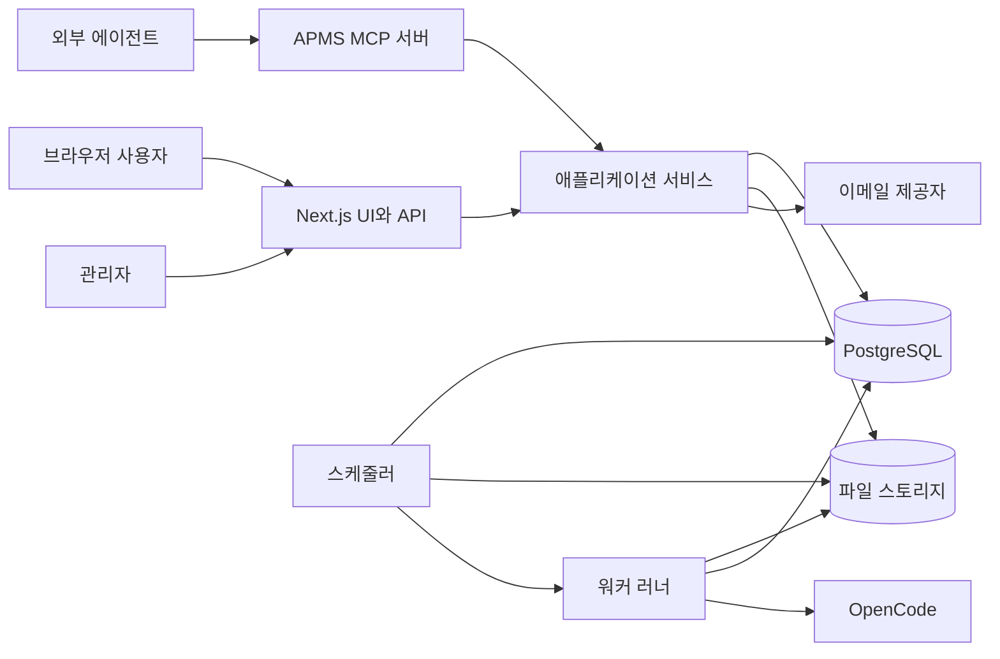
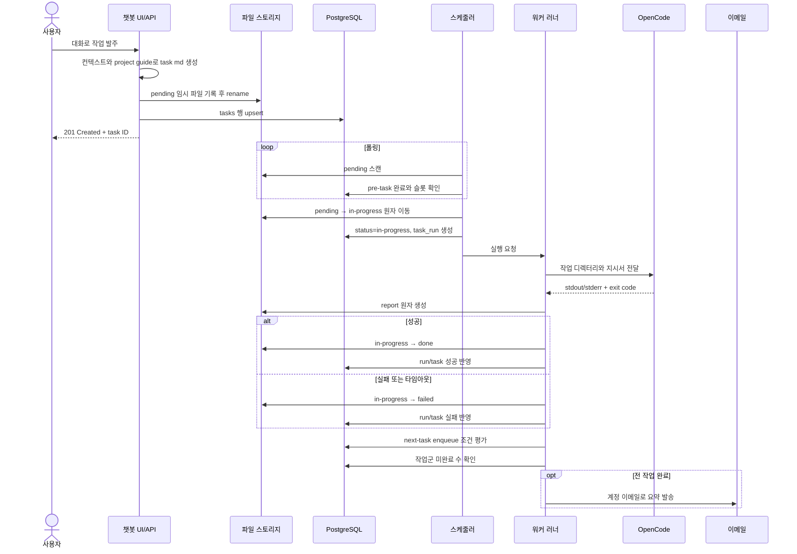
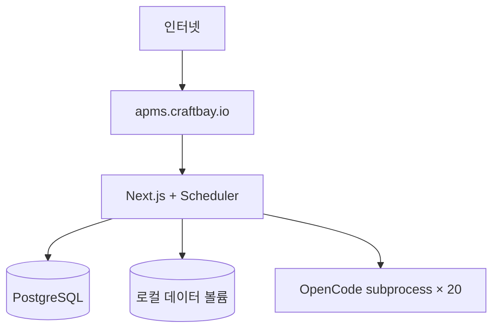
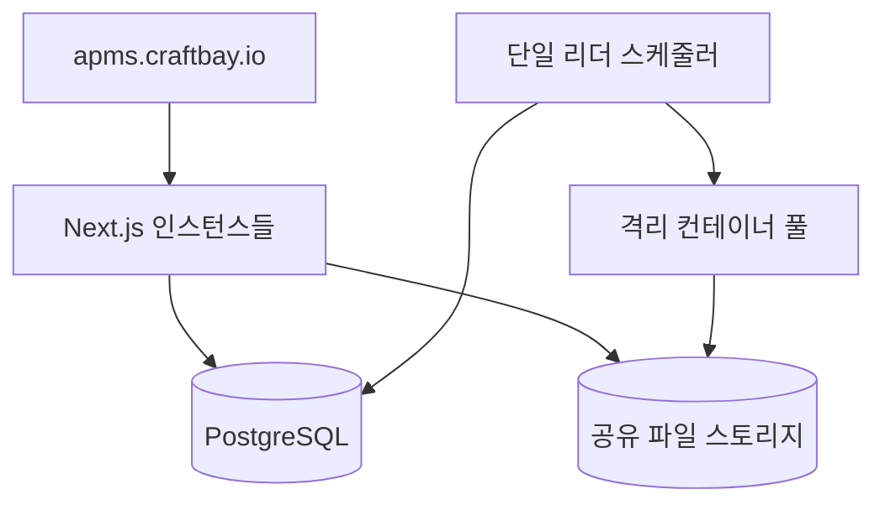
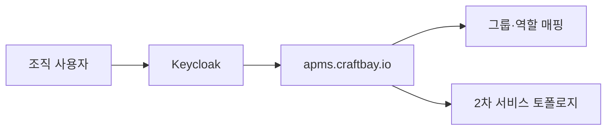

# APMS 아키텍처

## 1. 목적과 범위

이 문서는 APMS P1의 논리·배포 아키텍처와 주요 요청 흐름을 정의한다.
1차는 관리자 겸 사용자 1인 운영, 2차는 격리된 다중 사용자, 3차는 SSO 연동을 목표로 한다.
Markdown 파일을 업무 원본으로, PostgreSQL을 검색·상태·집계 인덱스로 사용한다.

## 2. 설계 원칙

| 원칙 | 적용 |
|---|---|
| 파일 우선 | 작업지시서와 보고서의 최종 내용은 Markdown이 진실이다. |
| 원자적 상태 전이 | 같은 파일시스템 안의 디렉터리 `rename`으로 큐 상태를 바꾼다. |
| 재구축 가능 | DB 인덱스는 파일 스캔으로 복구할 수 있다. |
| 최소 권한 | 웹, 스케줄러, 워커는 필요한 경로와 자격 증명만 받는다. |
| 사용자 경계 | 모든 조회와 파일 접근은 인증 사용자 및 프로젝트 소유권을 검사한다. |
| 관측 가능성 | 실행마다 로그, 시간, 종료 코드, 사용량과 보고서를 남긴다. |
| 단계적 격리 | 1차 subprocess를 2차 컨테이너 러너로 교체 가능하게 추상화한다. |

## 3. 구성요소

| 구성요소 | 책임 | 영속 상태 |
|---|---|---|
| Next.js 웹 | UI, REST API, 인증, Markdown 뷰어 | 없음 |
| PostgreSQL | 사용자, 프로젝트, 큐 인덱스, 실행·사용량 집계 | 관계형 데이터 |
| 파일 스토리지 | 지침, 작업, 보고서, 핸드오버 원본 | `{user}/{project}/...` |
| 스케줄러 | pending 스캔, 의존성 확인, 슬롯 배정 | DB lease |
| 워커 러너 | OpenCode subprocess 실행과 결과 판정 | 실행 로그 |
| 메일 알림 | 프로젝트 작업군 완료 통지 | 전송 결과 |
| APMS MCP 서버 | 에이전트용 프로젝트·작업·문서 도구 | 없음 |

## 4. 논리 구조

애플리케이션 서비스 계층은 웹 API와 MCP가 동일한 권한 검사와 트랜잭션을 재사용하게 한다.
MCP는 파일 경로를 직접 노출하지 않고 안정적인 사용자·프로젝트·작업 ID를 반환한다.
웹 프로세스는 장시간 실행을 수행하지 않으며 스케줄러에 큐 상태만 제공한다.

## 5. 요청 흐름

파일 생성과 DB insert는 단일 ACID 트랜잭션이 아니므로 보상 절차를 둔다.
파일 기록 성공 뒤 DB 기록이 실패하면 재색인기가 파일을 발견해 행을 생성한다.
DB 기록 뒤 응답이 끊겨도 idempotency key로 중복 발주를 방지한다.

## 6. 경계와 인터페이스

| 경계 | 입력 | 출력 | 실패 처리 |
|---|---|---|---|
| UI → API | JSON, 세션 쿠키 | JSON/Markdown | 표준 오류 본문 |
| API → 파일 | 검증된 상대 경로 | 원자 기록 | 임시 파일 제거 |
| API → DB | UUID와 메타데이터 | 행/집계 | 트랜잭션 rollback |
| 스케줄러 → 러너 | task/run ID | 완료 이벤트 | lease 만료 후 복구 |
| 러너 → OpenCode | 지시서, cwd, 환경 | 로그, 종료 코드 | timeout 후 종료 |
| 알림 → 이메일 | 수신자, 요약 | provider ID | 지수 backoff 재시도 |

## 7. 보안

비밀번호는 단방향 해시로 저장한다.
LLM API Key는 서버 관리 키로 암호화하고 평문을 로그나 응답에 포함하지 않는다.
모든 파일 경로는 정규화 후 데이터 루트 내부인지 검사한다.
공유 링크는 만료 시간과 난수 토큰을 가지며 기본적으로 읽기 전용이다.
관리 API는 `admin` 역할을 요구하고 일반 사용자는 자기 리소스만 접근한다.
워커 환경에는 해당 작업에 필요한 자격 증명만 주입한다.

## 8. 신뢰성과 복구

| 상황 | 복구 정책 |
|---|---|
| 스케줄러 재시작 | 만료 lease를 가진 in-progress 작업을 재조정한다. |
| 워커 비정상 종료 | 실행을 failed로 닫고 진단 보고서를 생성한다. |
| DB 장애 | 신규 변경을 중단하고 파일만 쓰는 부분 성공을 재색인한다. |
| 파일 장애 | 큐 픽업을 중단해 DB와 원본의 추가 불일치를 막는다. |
| 이메일 장애 | 작업 결과는 유지하고 알림만 별도 재시도한다. |
| 중복 이벤트 | task ID와 run attempt의 유일 제약으로 멱등 처리한다. |

## 9. 관측성

구조화 로그에는 request_id, user_id, project_id, task_id, run_id를 기록한다.
민감한 프롬프트와 키 값은 로그 필드에서 제거한다.
핵심 지표는 큐 깊이, 대기 시간, 실행 시간, 성공률, 슬롯 사용률이다.
알림 실패율, 세션 핸드오버 수, 토큰과 비용도 집계한다.
health는 웹, DB, 파일 쓰기 가능 여부, 스케줄러 heartbeat를 구분한다.

## 10. 배포 단계 비교

| 항목 | 1차 단독 사용 | 2차 다중 사용자 | 3차 SSO |
|---|---|---|---|
| 인증 | 자체 이메일/비밀번호 | 자체 계정과 역할 | Keycloak OIDC |
| 웹 | 단일 인스턴스 가능 | 수평 확장 가능 | OIDC callback 추가 |
| 워커 | 호스트 subprocess | 작업별 컨테이너 | 컨테이너 유지 |
| 스토리지 | 로컬 영속 볼륨 | 공유 POSIX 스토리지 | 동일 |
| 격리 | 프로세스 권한 | 사용자별 컨테이너·쿼터 | 조직·그룹 매핑 |
| 세션 | 서명 쿠키 | 중앙 DB 세션 | IdP 토큰 교환 |
| 운영 대상 | 관리자 겸 사용자 | 관리자와 일반 사용자 | 조직 계정 |

### 10.1 1차

단일 호스트 장애 영역을 수용하되 DB와 데이터 볼륨은 정기 백업한다.

### 10.2 2차

스케줄러는 advisory lock 또는 leader lease로 한 인스턴스만 배정한다.

### 10.3 3차

로컬 비밀번호 로그인은 운영 정책에 따라 비활성화하고 비상 관리자만 별도 관리한다.

## 11. 확장 지점

Runner 인터페이스는 subprocess와 container 구현을 동일한 입력·결과 타입으로 감싼다.
Notification 인터페이스는 이메일 외 채널을 추가할 수 있게 한다.
LLM connection은 공급자별 base URL, 모델, 암호화 자격 증명을 캡슐화한다.
MCP 서버는 REST와 동일한 서비스 메서드를 호출해 규칙 중복을 피한다.

## 12. 완료 기준

- 발주부터 보고서까지 파일과 DB 상태를 추적할 수 있다.
- 동시 실행은 전역 20개를 넘지 않는다.
- 선행 작업이 끝나지 않은 작업은 실행되지 않는다.
- 성공·실패 모두 보고서와 실행 로그를 남긴다.
- 프로젝트 작업군 종료 시 이메일을 한 번만 발송한다.
- DB 인덱스를 파일 원본으로 재구축할 수 있다.
- 단계별 배포에서 API와 파일 규격이 유지된다.
