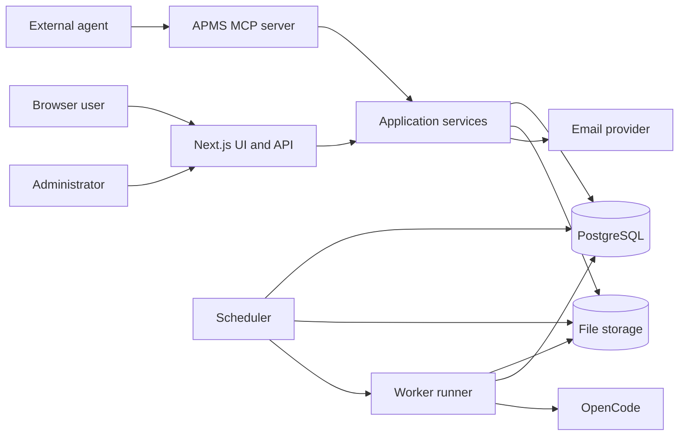
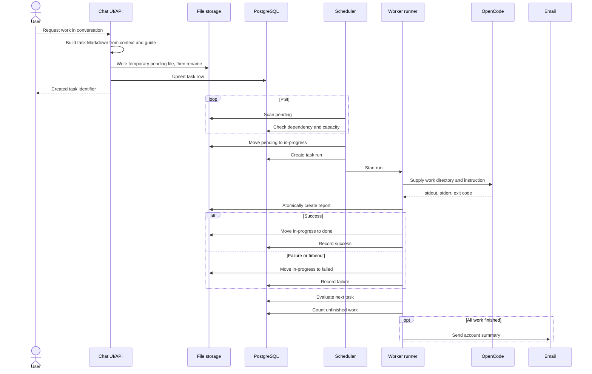
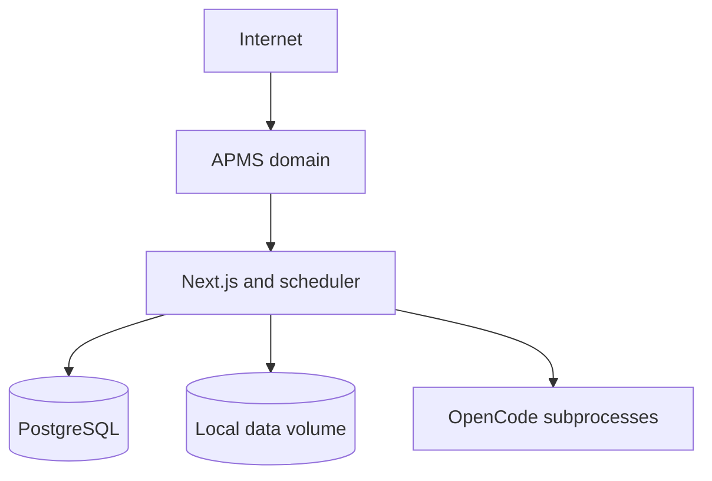
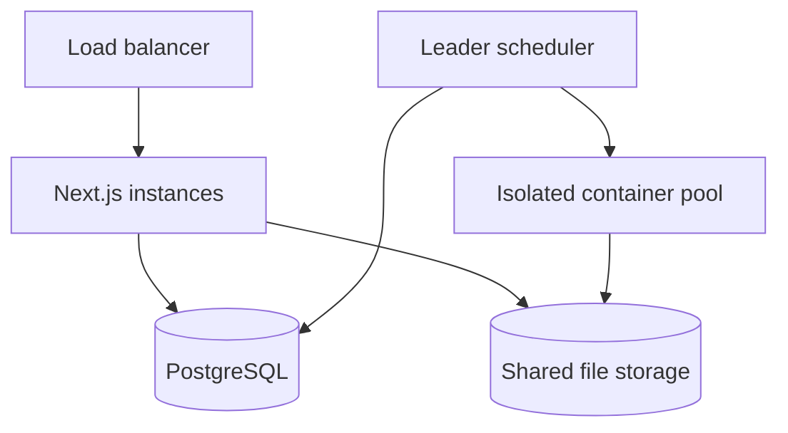
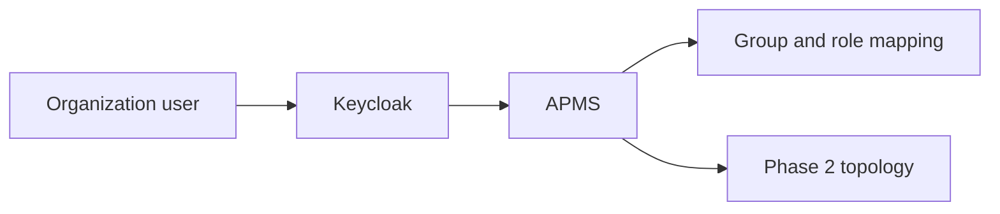

# APMS Architecture

## 1. Purpose and scope

*Implementation status: partial*

This document defines the logical and deployment architecture for APMS P1.
Phase 1 targets a single operator who is both administrator and user, Phase 2 targets isolated multi-user operation, and Phase 3 adds SSO.
Markdown files are the operational source of truth; PostgreSQL is the search, state, and aggregation index.

## 2. Design principles

*Implementation status: partial*

| Principle | Application |
|---|---|
| File first | Final task instructions and reports live in Markdown. |
| Atomic transitions | Queue state changes use directory `rename` on one filesystem. |
| Rebuildable | File scanning can rebuild the database index. |
| Least privilege | Web, scheduler, and workers receive only required paths and credentials. |
| User boundary | Every query and file access checks the authenticated user and project ownership. |
| Observable | Every run retains logs, timing, exit code, usage, and a report. |
| Progressive isolation | A runner interface allows the Phase 1 subprocess to become a Phase 2 container. |

File-first storage, ownership checks, run records, and a runner interface exist. Full credential isolation and the container runner remain planned.

## 3. Components

*Implementation status: partial*

| Component | Responsibility | Persistent state |
|---|---|---|
| Next.js web | UI, REST API, authentication, Markdown viewer | None |
| PostgreSQL | Users, projects, queue index, run and usage aggregates | Relational data |
| File storage | Guides, tasks, reports, and handover sources | `{user}/{project}/...` |
| Scheduler | Scan pending work, check dependencies, allocate slots | Scheduler state |
| Worker runner | Run an OpenCode subprocess and determine the result | Run logs and report |
| Email notification | Notify when a project workload finishes | Delivery result |
| APMS MCP server | Project, task, and document tools for external agents | None |

The web, database, storage, scheduler, runner, and email adapter are implemented. The MCP server is planned.

## 4. Logical structure

*Implementation status: partial*

The intended application-service layer lets web APIs and MCP share authorization and transactions.
MCP must return stable IDs rather than exposing file paths.
Long-running work belongs to the scheduler and worker, not request handlers.
The current implementation shares library functions but does not yet provide a distinct service layer or MCP server.

## 5. Request flow

*Implementation status: partial*

Files and database rows cannot share one ACID transaction, so reconciliation is the compensation mechanism.
If file creation succeeds but indexing fails, the reconciler can discover it later.
Task creation is implemented; durable idempotency keys and a batch-level completion model are planned.

## 6. Boundaries and interfaces

*Implementation status: partial*

| Boundary | Input | Output | Failure handling |
|---|---|---|---|
| UI to API | JSON, session cookie | JSON or Markdown | Standard error body |
| API to files | Validated relative path | Atomic write | Remove temporary file |
| API to database | UUID and metadata | Rows and aggregates | Transaction rollback |
| Scheduler to runner | Task and run IDs | Completion event | Recovery after failure |
| Runner to OpenCode | Instruction, cwd, environment | Logs and exit code | Terminate after timeout |
| Notification to email | Recipient and summary | Provider ID | Independent retry |

Most concrete boundaries exist. Formal leases, durable retries, and the shared MCP/service boundary are not complete.

## 7. Security

*Implementation status: partial*

Passwords use one-way hashes.
LLM API keys use application-layer encryption and must never appear in logs or responses.
Document and task paths are normalized under the data root.
Share links are read-only and expire.
Admin APIs require the `admin` role; users may access only owned resources.
Workers should receive only credentials needed by their run.

Authentication, ownership checks, encrypted LLM connections, data-root document paths, and seven-day share expiry are implemented.
Rate limiting, immutable user slugs, a write-only secret store, strict worker credential isolation, and restricting configured workdirs to an allowlist are planned.

## 8. Reliability and recovery

*Implementation status: partial*

| Situation | Recovery policy |
|---|---|
| Scheduler restart | Recover orphaned in-progress work. |
| Worker crash | Close the run as failed and create a diagnostic report. |
| Database outage | Stop new mutations and reconcile partial file success later. |
| File outage | Stop pickup to avoid greater divergence. |
| Email outage | Keep work results and retry notification separately. |
| Duplicate event | Enforce uniqueness by task filename and run attempt. |

Startup orphan recovery, unique run attempts, and durable notification rows exist.
Lease expiry, notification backoff, and complete partial-failure repair remain incomplete.

## 9. Observability

*Implementation status: partial*

Structured logs should carry request, user, project, task, and run identifiers.
Sensitive prompts and credentials must be removed from log fields.
Primary metrics are queue depth, wait time, run duration, success rate, and slot utilization.
Notification failures, handovers, tokens, and cost also require aggregation.
Health should distinguish web, database, writable storage, and scheduler heartbeat.

Run records, usage aggregation, scheduler heartbeat, and health checks exist; full structured logging and metrics export are planned.

## 10. Deployment phase comparison

*Implementation status: planned*

| Item | Phase 1: single user | Phase 2: multi-user | Phase 3: SSO |
|---|---|---|---|
| Authentication | Local email/password | Local accounts and roles | Keycloak OIDC |
| Web | One instance | Horizontally scalable | OIDC callback added |
| Worker | Host subprocess | Per-task container | Container retained |
| Storage | Local persistent volume | Shared POSIX storage | Same |
| Isolation | Process permissions | Per-user containers and quotas | Organization/group mapping |
| Session | Signed cookie | Central database session | IdP token exchange |
| Operators | Admin is also user | Admins and users | Organization accounts |

### 10.1 Phase 1

The current deployment accepts a single-host failure domain; database and data volumes require regular backup.

### 10.2 Phase 2

Only one scheduler may dispatch work, selected by an advisory lock or leader lease.

### 10.3 Phase 3

Local password login can be disabled by policy while a separately managed emergency administrator remains available.

## 11. Extension points

*Implementation status: partial*

The Runner interface wraps subprocess and future container implementations in one input/result contract.
The Notification interface is intended to support channels beyond email.
An LLM connection encapsulates provider base URL, model, and encrypted credentials.
The planned MCP server should call the same service methods as REST to avoid duplicated rules.

Runner and LLM provider abstractions exist. Container, webhook/Telegram notification adapters, GitProvider, SecretProvider, and MCP remain planned.

## 12. Completion criteria

*Implementation status: partial*

- File and database state can be traced from request through report.
- Global concurrent execution never exceeds 20.
- A task whose prerequisite is unfinished does not run.
- Success and failure both retain a report and run record.
- Project completion sends one email notification.
- File sources can rebuild the task index.
- API and file formats remain stable across deployment phases.

The Phase 1 flow covers most criteria. Complete log retention, strict multi-instance concurrency, batch notifications, and cross-phase compatibility remain partial or planned.
