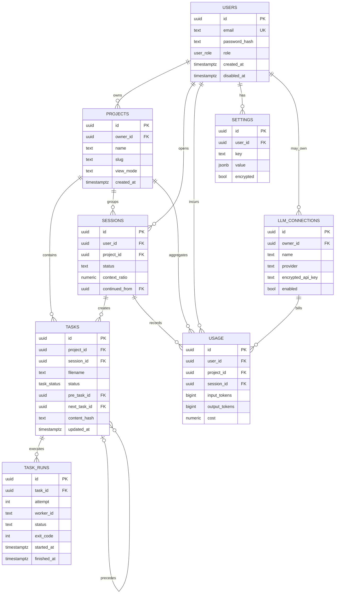
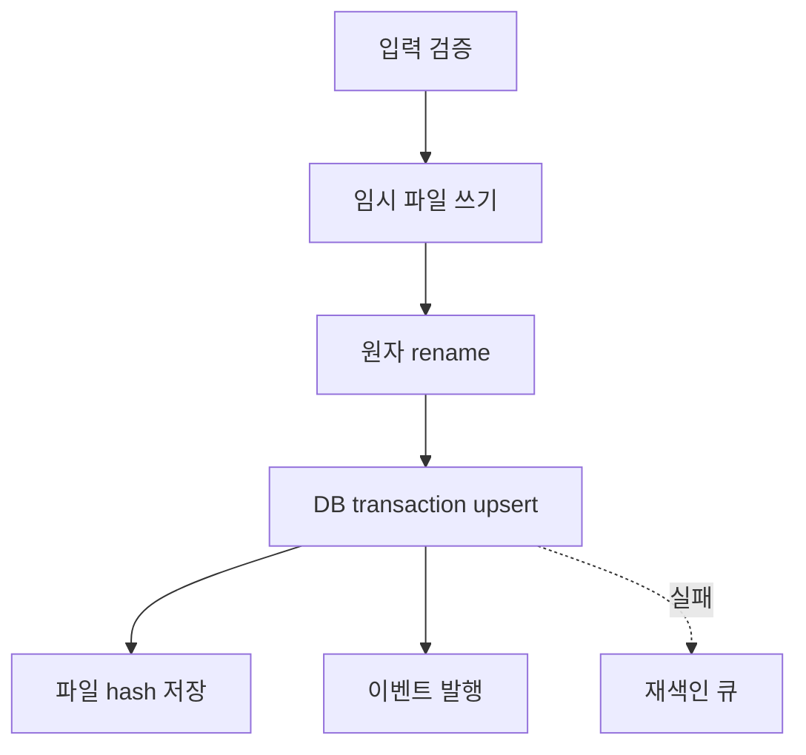

# APMS 데이터 모델

## 1. 목적

이 문서는 PostgreSQL 논리 스키마와 Markdown 파일시스템 간 책임을 정의한다.
파일은 지침·작업·보고서 내용의 진실이며 DB는 인증, 인덱스, 실행 이력과 집계를 담당한다.
모든 시각은 `timestamptz`, 모든 식별자는 UUID를 사용한다.

## 2. 공통 규칙

| 항목 | 규칙 |
|---|---|
| PK | `uuid`, 서버 생성 |
| 시간 | UTC `timestamptz` |
| slug | 소문자 영숫자와 하이픈 |
| 금액 | `numeric(18,8)`, 통화 코드 동반 |
| 토큰 | `bigint`, 음수 금지 |
| 삭제 | 기본 soft delete, 필요 시 cascade 명시 |
| 비밀값 | 애플리케이션 계층 envelope encryption |

## 3. ER 다이어그램

## 4. users

| 컬럼 | 타입 | 제약/설명 |
|---|---|---|
| `id` | uuid | PK |
| `email` | citext | unique, 로그인 ID |
| `password_hash` | text | SSO 전 단계의 단방향 해시 |
| `role` | user_role | `admin`, `user` |
| `display_name` | text | nullable |
| `created_at` | timestamptz | 생성 시각 |
| `updated_at` | timestamptz | 수정 시각 |
| `disabled_at` | timestamptz | nullable, 로그인 차단 |

이메일은 정규화 후 유일성을 보장한다.
API에서 `password_hash`를 반환하지 않는다.
3차 SSO에서는 외부 subject 매핑 테이블을 추가할 수 있다.

## 5. projects

| 컬럼 | 타입 | 제약/설명 |
|---|---|---|
| `id` | uuid | PK |
| `owner_id` | uuid | users FK |
| `name` | text | 표시명 |
| `slug` | text | 사용자 내 unique |
| `view_mode` | text | `card` 또는 `list` |
| `archived_at` | timestamptz | nullable |
| `created_at` | timestamptz | 생성 시각 |
| `updated_at` | timestamptz | 수정 시각 |

유일 제약은 `(owner_id, slug)`다.
삭제는 파일 보존을 위해 기본적으로 archive 처리한다.

## 6. tasks

| 컬럼 | 타입 | 제약/설명 |
|---|---|---|
| `id` | uuid | PK |
| `project_id` | uuid | projects FK |
| `session_id` | uuid | sessions FK, nullable |
| `filename` | text | 프로젝트 내 unique |
| `title` | text | frontmatter 인덱스 |
| `status` | task_status | pending/in-progress/done/failed |
| `pre_task_id` | uuid | tasks self FK, nullable |
| `next_task_id` | uuid | tasks self FK, nullable |
| `timeout_min` | integer | 1~1440 |
| `content_hash` | text | SHA-256 |
| `created_at` | timestamptz | frontmatter와 일치 |
| `updated_at` | timestamptz | DB 반영 시각 |

`filename`과 status는 파일 위치에서 유도한다.
DB 상태만 바꿔 파일을 이동하는 동작은 금지한다.
의존성은 같은 프로젝트로 제한하고 순환을 애플리케이션에서 거부한다.

## 7. task_runs

| 컬럼 | 타입 | 제약/설명 |
|---|---|---|
| `id` | uuid | PK |
| `task_id` | uuid | tasks FK |
| `attempt` | integer | task 내 1부터 증가 |
| `worker_id` | text | 러너 인스턴스 식별자 |
| `runner_type` | text | subprocess/container |
| `status` | text | leased/running/done/failed/timed_out |
| `pid_or_container_id` | text | nullable, 운영용 |
| `log_uri` | text | 상대 식별자 |
| `exit_code` | integer | nullable |
| `failure_reason` | text | nullable, 정제된 요약 |
| `guide_hash` | text | 실행 시 지침 해시 |
| `lease_expires_at` | timestamptz | 복구 기준 |
| `started_at` | timestamptz | 시작 시각 |
| `finished_at` | timestamptz | 종료 시각 |

유일 제약은 `(task_id, attempt)`다.
실행 로그는 append-only이며 완료 행을 덮어쓰지 않는다.

## 8. sessions

| 컬럼 | 타입 | 제약/설명 |
|---|---|---|
| `id` | uuid | PK |
| `user_id` | uuid | users FK |
| `project_id` | uuid | projects FK |
| `title` | text | 채팅 제목 |
| `status` | text | active/handed_over/closed |
| `context_tokens` | bigint | 현재 사용량 |
| `context_limit` | bigint | 모델 한도 |
| `context_ratio` | numeric(5,4) | 0~1 캐시 값 |
| `continued_from` | uuid | sessions self FK |
| `created_at` | timestamptz | 생성 시각 |
| `closed_at` | timestamptz | nullable |

대화 원문 저장 정책은 별도 보존 설정을 따른다.
70% 도달 시 기존 세션을 handed_over로 닫고 새 세션을 연결한다.

## 9. usage

| 컬럼 | 타입 | 제약/설명 |
|---|---|---|
| `id` | uuid | PK |
| `user_id` | uuid | users FK |
| `project_id` | uuid | projects FK, nullable |
| `session_id` | uuid | sessions FK, nullable |
| `task_run_id` | uuid | task_runs FK, nullable |
| `connection_id` | uuid | llm_connections FK |
| `model` | text | 실제 호출 모델 |
| `input_tokens` | bigint | 0 이상 |
| `output_tokens` | bigint | 0 이상 |
| `cached_tokens` | bigint | 0 이상 |
| `cost` | numeric(18,8) | 계산 비용 |
| `currency` | char(3) | ISO 코드 |
| `occurred_at` | timestamptz | 호출 시각 |

usage는 append-only 원장이다.
사용자·프로젝트·일자 인덱스로 대시보드 집계를 지원한다.
공급자 비용 미확정 시 비용은 null로 두고 후처리한다.

## 10. llm_connections

| 컬럼 | 타입 | 제약/설명 |
|---|---|---|
| `id` | uuid | PK |
| `owner_id` | uuid | users FK, null이면 전역 |
| `name` | text | 범위 내 unique |
| `provider` | text | 공급자 식별자 |
| `base_url` | text | HTTPS URL |
| `default_model` | text | 모델명 |
| `encrypted_api_key` | text | 암호문 envelope |
| `key_version` | integer | 키 회전 버전 |
| `enabled` | boolean | 사용 가능 여부 |
| `created_by` | uuid | 관리자 users FK |
| `updated_at` | timestamptz | 변경 시각 |

관리자만 전역 연결을 생성·변경한다.
일반 사용자의 개인 연결 허용 여부는 관리자 정책으로 제어한다.
API 응답은 키 존재 여부와 마지막 네 글자 마스킹만 반환한다.

## 11. settings

| 컬럼 | 타입 | 제약/설명 |
|---|---|---|
| `id` | uuid | PK |
| `user_id` | uuid | users FK |
| `key` | text | 계정 내 unique |
| `value` | jsonb | 일반 값 또는 암호문 envelope |
| `encrypted` | boolean | 복호화 필요 여부 |
| `key_version` | integer | nullable |
| `updated_at` | timestamptz | 수정 시각 |

유일 제약은 `(user_id, key)`다.
API Key와 토큰 종류는 반드시 암호화 저장한다.
암호화는 데이터 키와 외부 마스터 키를 분리하고 nonce를 재사용하지 않는다.
민감 설정은 목록 API에서 값을 반환하지 않는다.

## 12. 권장 보조 테이블

| 테이블 | 목적 |
|---|---|
| `share_links` | Markdown 공유 토큰, 만료, 폐기 |
| `notifications` | 이메일 멱등성, 전송 상태, 재시도 |
| `scheduler_leases` | 리더와 작업 lease |
| `audit_events` | 관리자·상태 변경 감사 |
| `file_sync_errors` | 파싱·동기화 오류 격리 |

이 표의 테이블은 API 구현 시 마이그레이션에 포함할 수 있다.

## 13. 파일과 DB 역할 분담

| 데이터 | 파일 | DB |
|---|---|---|
| guide/proposal/dev/next | 원문 | 경로, hash, 수정 시각 |
| 작업지시서 | 원문과 상태 디렉터리 | 검색 필드와 상태 인덱스 |
| 보고서 | 원문 | 연결 task/run, 요약 |
| 사용자/인증 | 없음 | 진실 |
| 실행 로그 | 선택적 파일/로그 저장소 | 메타데이터와 결과 |
| 세션/사용량 | 선택적 내보내기 | 진실 |
| API Key | 금지 | 암호문 |

## 14. 쓰기 동기화

파일 쓰기가 실패하면 DB를 변경하지 않는다.
파일 성공 후 DB 실패는 파일을 유지하고 재색인 대상으로 기록한다.
상태 이동은 파일 rename 성공 후 DB를 갱신한다.
API는 idempotency key로 동일 발주의 중복 파일 생성을 막는다.

## 15. 조정과 복구

조정기는 시작 시와 주기적으로 데이터 루트를 스캔한다.
경로에서 사용자, 프로젝트, 상태, 파일명을 도출한다.
frontmatter를 검증하고 SHA-256을 계산한다.
DB 행이 없으면 생성하고 hash가 다르면 파일 기준으로 갱신한다.
DB에만 있는 작업은 즉시 삭제하지 않고 `missing_file` 오류로 격리한다.
동일 작업이 여러 상태에 있으면 자동 선택하지 않고 운영자 확인을 요구한다.

## 16. 인덱스

| 테이블 | 인덱스 |
|---|---|
| users | unique lower(email) |
| projects | unique(owner_id, slug) |
| tasks | unique(project_id, filename), (status, created_at) |
| task_runs | unique(task_id, attempt), (status, lease_expires_at) |
| sessions | (user_id, project_id, status) |
| usage | (user_id, occurred_at), (project_id, occurred_at) |
| settings | unique(user_id, key) |

## 17. 보존과 개인정보

작업과 보고서는 프로젝트 보존 정책을 따른다.
실행 로그는 기본 보존 기간 후 축약하거나 삭제할 수 있다.
usage 집계는 원본 호출 로그보다 오래 보존할 수 있다.
사용자 비활성화는 즉시 로그인과 새 실행을 차단한다.
사용자 삭제는 감사·법적 요구에 따라 익명화와 파일 archive를 분리한다.

## 18. 마이그레이션 원칙

마이그레이션은 전진 적용 가능하고 반복 실행에 안전해야 한다.
enum 변경보다 check constraint 또는 참조 테이블을 우선 검토한다.
대형 backfill은 스키마 변경과 분리한다.
배포 전 백업과 rollback 절차를 준비한다.
파일 규격 버전이 필요하면 frontmatter에 선택적 `schema_version`을 추가한다.

## 19. 무결성 체크리스트

- task의 owner는 project owner로 해석 가능하다.
- task 상태와 실제 디렉터리가 일치한다.
- content_hash가 현재 파일과 일치한다.
- task_run attempt가 연속이며 동시에 하나만 running이다.
- 완료 run에는 finished_at과 exit_code가 있다.
- usage의 사용자와 프로젝트 소유권이 일치한다.
- 비밀값 컬럼은 평문 검색과 로그 출력이 불가능하다.
- 파일 스캔만으로 tasks 인덱스를 다시 만들 수 있다.
