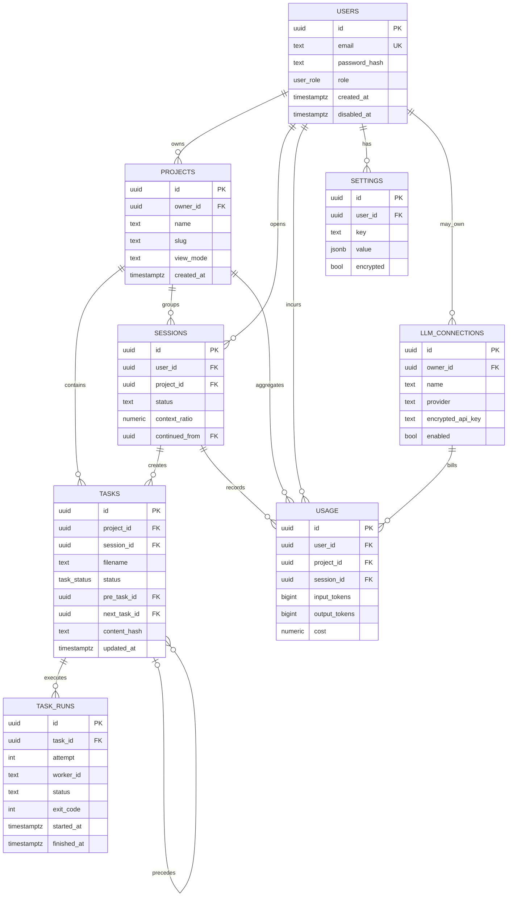

# APMS Data Model

## 1. Purpose

*Implementation status: partial*

This document defines the responsibilities between the PostgreSQL logical schema and the Markdown filesystem.
The file is the truth of the instructions, work, and report contents, and the DB is in charge of authentication, index, execution history, and aggregation.
All times are `timestamptz` and all identifiers use the UUID.

## 2. Common Rules

*Implementation status: implemented*

| Items | Rules |
|---|---|
| PK | `uuid`, create server |
| Time | UTC `timestamptz` |
| slug | Lowercase alphanumeric and hyphen |
| Amount | `numeric (18,8)` with currency code |
| token | `bigint`, no negative numbers |
| delete | default soft delete, specify cascade if needed |
| Secret | Application layer envelope encryption |

## 3. ER diagram

*Implementation status: partial*



## 4. users

*Implementation status: partial*

| Column | Type | Constraint/Description |
|---|---|---|
| `id` | uuid | PK |
| `email` | citext | unique, login ID |
| `password_hash` | text | One-way hash before SSO |
| `role` | user_role | `admin`, `user` |
| `display_name` | text | nullable |
| `created_at` | timestamptz | Created at |
| `updated_at` | timestamptz | Edit time |
| `disabled_at` | timestamptz | nullable, blocking login |

Email guarantees uniqueness after normalization.
API does not return `password_hash`.
In tertiary SSO, an external subject mapping table can be added.

## 5. projects

*Implementation status: partial*

| Column | Type | Constraint/Description |
|---|---|---|
| `id` | uuid | PK |
| `owner_id` | uuid | users FK |
| `name` | text | Display name |
| `slug` | text | Unique within users |
| `view_mode` | text | `card` or `list` |
| `archived_at` | timestamptz | nullable |
| `created_at` | timestamptz | Created at |
| `updated_at` | timestamptz | Edit time |

The only constraint is` (owner_id, slug) `.
Deletion is handled by default for file preservation.

## 6. tasks

*Implementation status: partial*

| Column | Type | Constraint/Description |
|---|---|---|
| `id` | uuid | PK |
| `project_id` | uuid | projects FK |
| `session_id` | uuid | sessions FK, nullable |
| `filename` | text | Unique in project |
| `title` | text | frontmatter index |
| `status` | task_status | pending/in-progress/done/failed |
| `pre_task_id` | uuid | tasks self FK, nullable |
| `next_task_id` | uuid | tasks self FK, nullable |
| `timeout_min` | integer | 1~1440 |
| `content_hash` | text | SHA-256 |
| `created_at` | timestamptz | matches frontmatter |
| `updated_at` | timestamptz | DB reflection time |

`filename` and status are derived from the file location.
It is forbidden to move files by changing only the DB state.
Dependencies restrict to the same project and deny circulation in the application.

## 7. task_runs

*Implementation status: partial*

| Column | Type | Constraint/Description |
|---|---|---|
| `id` | uuid | PK |
| `task_id` | uuid | tasks FK |
| `attempt` | integer | Increase from 1 in task |
| `worker_id` | text | Runner instance identifier |
| `runner_type` | text | subprocess/container |
| `status` | text | leased/running/done/failed/timed_out |
| `pid_or_container_id` | text | nullable, operational |
| `log_uri` | text | Relative identifiers |
| `exit_code` | integer | nullable |
| `failure_reason` | text | nullable, refined summary |
| `guide_hash` | text | Instructions hash on launch |
| `lease_expires_at` | timestamptz | Recovery Criteria |
| `started_at` | timestamptz | Start time |
| `finished_at` | timestamptz | End time |

The only constraint is` (task_id, attempt) `.
The execution log is append-only and does not overwrite the completion line.

## 8. sessions

*Implementation status: partial*

| Column | Type | Constraint/Description |
|---|---|---|
| `id` | uuid | PK |
| `user_id` | uuid | users FK |
| `project_id` | uuid | projects FK |
| `title` | text | Chat title |
| `status` | text | active/handed_over/closed |
| `context_tokens` | bigint | Current usage |
| `context_limit` | bigint | Model Limit |
| `context_ratio` | numeric (5,4) | 0 to 1 cache value |
| `continued_from` | uuid | sessions self FK |
| `created_at` | timestamptz | Created at |
| `closed_at` | timestamptz | nullable |

The original dialogue saving policy follows a separate retention setting.
When 70% is reached, close the existing session with handed_over and link the new session.

## 9. usage

*Implementation status: partial*

| Column | Type | Constraint/Description |
|---|---|---|
| `id` | uuid | PK |
| `user_id` | uuid | users FK |
| `project_id` | uuid | projects FK, nullable |
| `session_id` | uuid | sessions FK, nullable |
| `task_run_id` | uuid | task_runs FK, nullable |
| `connection_id` | uuid | llm_connections FK |
| `model` | text | Actual call model |
| `input_tokens` | bigint | 0 + |
| `output_tokens` | bigint | 0 + |
| `cached_tokens` | bigint | 0 + |
| `cost` | numeric (18,8) | Calculation costs |
| `currency` | char (3) | ISO code |
| `occurred_at` | timestamptz | Call time |

usage is append-only ledger.
Supports dashboard aggregation with user, project, and date indexes.
If the supplier cost is undetermined, the cost is left null and post-processed.

## 10. llm_connections

*Implementation status: partial*

| Column | Type | Constraint/Description |
|---|---|---|
| `id` | uuid | PK |
| `owner_id` | uuid | users FK, global if null |
| `name` | text | Unique in scope |
| `provider` | text | Supplier identifier |
| `base_url` | text | HTTPS URL |
| `default_model` | text | Model name |
| `encrypted_api_key` | text | ciphertext envelope |
| `key_version` | integer | Key rotation version |
| `enabled` | boolean | Availability |
| `created_by` | uuid | Admin users FK |
| `updated_at` | timestamptz | Change time |

Only administrators create/change global connections.
Administrator policy controls whether normal users are allowed to make personal connections.
The API response returns only the presence of the key and the masking of the last four characters.

## 11. settings

*Implementation status: partial*

| Column | Type | Constraint/Description |
|---|---|---|
| `id` | uuid | PK |
| `user_id` | uuid | users FK |
| `key` | text | Unique in your account |
| `value` | jsonb | Common value or ciphertext envelope |
| `encrypted` | boolean | Whether decryption is required |
| `key_version` | integer | nullable |
| `updated_at` | timestamptz | Edit time |

The only constraint is` (user_id, key) `.
The API Key and token type must be stored encrypted.
Encryption separates the data key from the external master key and does not reuse the nonce.
Sensitive settings do not return a value from the list API.

## 12. Recommended Auxiliary Tables

*Implementation status: planned*

Table Purpose
|---|---|
| `share_links` | Markdown share token, expiration, revocation |
| `notifications` | Email Equivalence, Sending Status, Retry |
| `scheduler_leases` | Leader and task lease |
| `audit_events` | Admin · Audit status change |
| `file_sync_errors` | Isolate parsing and sync errors |

The tables in this table can be included in the migration when implementing the API.

## 13. Split file and DB roles

*Implementation status: partial*

| data | file | DB |
|---|---|---|
| guide/proposal/dev/next | Original | Path, hash, Revision time |
| Work Order | Original Text and Status Directory | Search Fields and Status Index |
| Report | Original | Connected task/run, summary |
| User/Authentication | None | Truth |
| Execution Log | Optional File/Log Storage | Metadata and Results |
| Sessions/Usage | Optional Export | Truth |
| API Key | Ban | Ciphertext |

## 14. Synchronizing writes

*Implementation status: partial*

```mermaid
flowchart TD
V [Input validation] --> T [Temporary file writing]
T --> R [atomic rename]
  R --> D[DB transaction upsert]
D --> H [save file hash]
D --> E [publish event]
D -. Fail. - > Q [Reindex cue]
```

If the file write fails, do not change the DB.
DB failure after file success maintains the file and records it as a reindex object.
The state move updates the DB after a successful file rename.
The API is an idempotency key to prevent duplicate file creation of the same order.

## 15. Adjustment and Recovery

*Implementation status: partial*

The regulator scans the data route at startup and periodically.
Derive the user, project, status, and file name from the path.
verify the frontmatter and calculate SHA-256.
If there is no DB line, create it, and if the hash is different, update it based on the file.
Quarantine tasks that are only in the DB with the error `missing_file` without immediately deleting them.
If the same task is in multiple states, ask for operator confirmation without auto-selection.

## 16. Index

*Implementation status: partial*

| Table | Index |
|---|---|
| users | unique lower(email) |
| projects | unique(owner_id, slug) |
| tasks | unique(project_id, filename), (status, created_at) |
| task_runs | unique(task_id, attempt), (status, lease_expires_at) |
| sessions | (user_id, project_id, status) |
| usage | (user_id, occurred_at), (project_id, occurred_at) |
| settings | unique(user_id, key) |

## 17. Preservation and privacy

*Implementation status: planned*

Tasks and reports follow a project retention policy.
Execution logs can be abbreviated or deleted after the default retention period.
the usage aggregation can be retained longer than the original call log.
Deactivating a user immediately blocks login and new execution.
User deletion separates anonymization from file archive based on audit and legal requirements.

## 18. Migration principles

*Implementation status: planned*

The migration must be forward applicable and safe for iterative execution.
check constraint or reference table before changing enum.
The large backfill is separated from the schema change.
Prepare backup and rollback procedures before deployment.
If you need a file specification version, add an optional `schema_version` to the frontmatter.

## 19. Integrity checklist

*Implementation status: partial*

- The owner of the task can be interpreted as the project owner.
- The task state and the actual directory match.
- content_hash matches the current file.
- The task_run attempt is continuous and only one is running at the same time.
- Finished runs include finished_at and exit_code.
- The user and project ownership of usage match.
- The secret value column is not possible to search plain text and log output.
- You can recreate the tasks index just by scanning the file.
